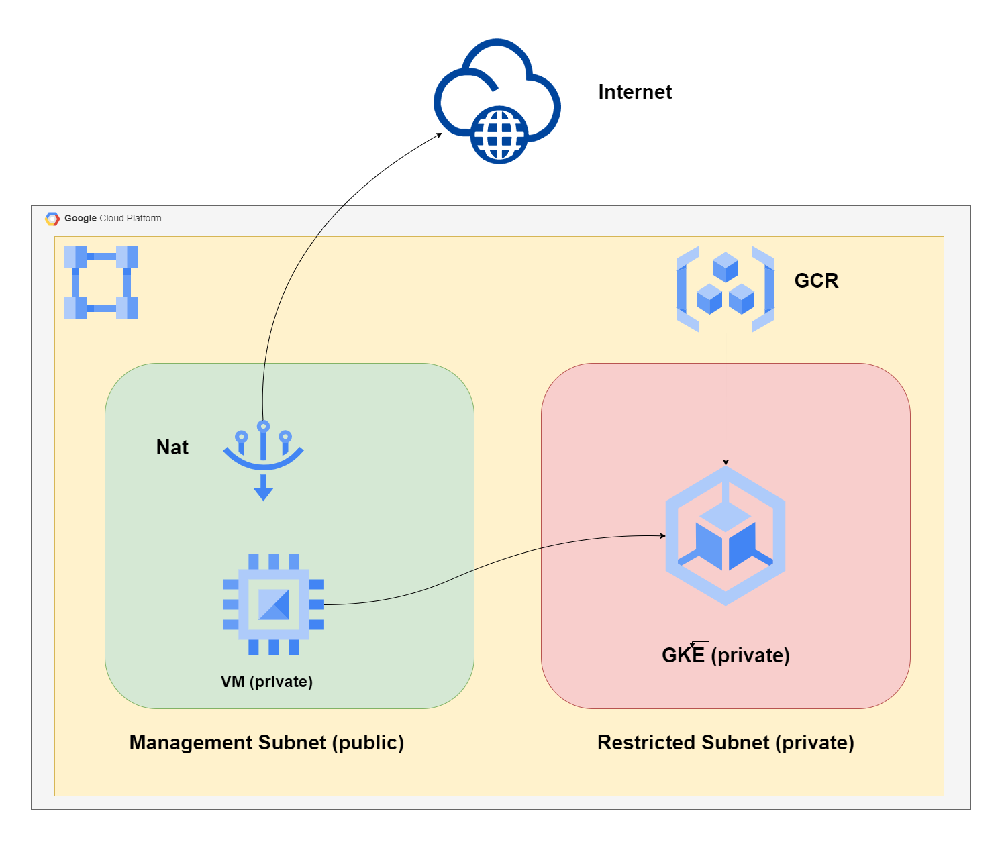
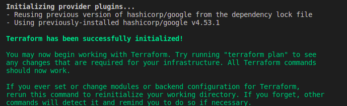
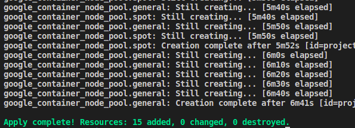
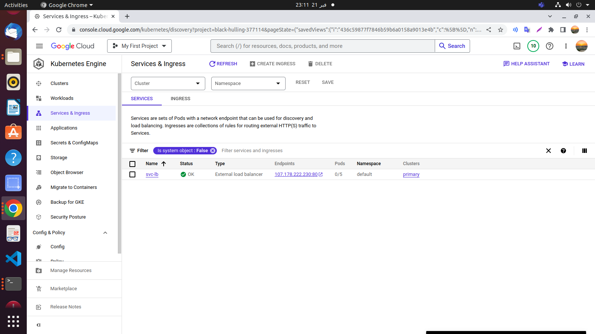
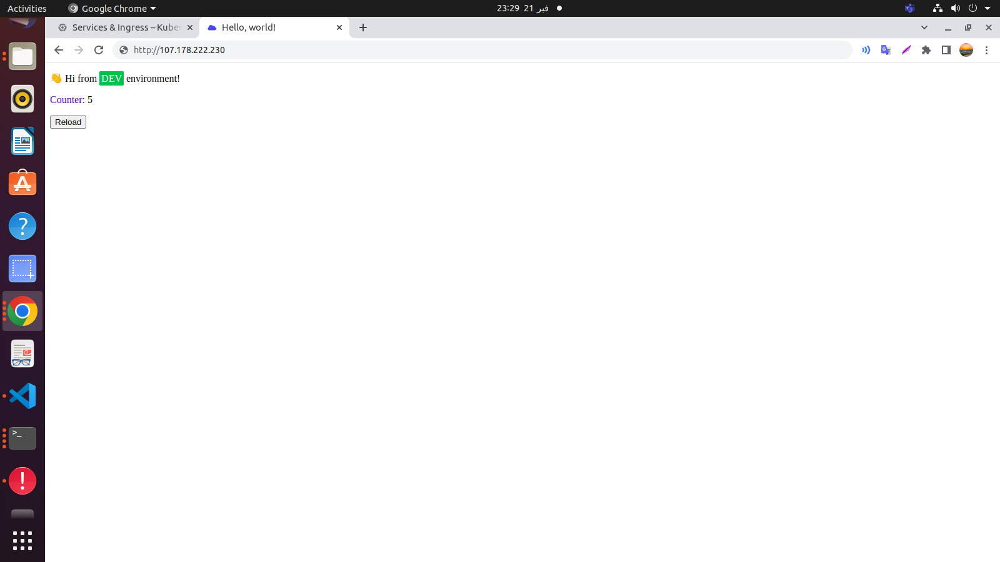

# GCP - Final Task 

**This repository contains Terraform configuration for setting up infrastructure on Google Cloud Platform (GCP) using Infrastructure as Code (IaC) principles.**

## Requirements
-   Terraform
-   Google Cloud SDK
-   Access to a GCP project with the necessary permissions to create and manage resources.
-   Create a bucket for the terraform state backend

## Flow Chart



## Task


## Getting started

### Local Steps

1. clone this repo :
   ```bash
   git clone https://github.com/95remon/Google-Cloud-Platform-ITI.git
   ```

2. Navigate to Infrastructure-code directory.

3. Change the needed fields as back-end bucket name, Project ID, .... etc.

4. Run terraform commands:
    ```bash
    terraform init
    ```
    
    
    ```bash
    terraform apply
    ```
    

5. Navigate to Application directory.

6. Build Dockerfile and push image to GCR (Replace "focused-bridge-317713" with your project ID):

    ```bash
    docker build . -t gcr.io/black-hulling-377114/py-app
    ```
    ```bash
    docker push gcr.io/black-hulling-377114/py-app
    ```

### Private VM Steps

1. SSH the VM through browser
2. Update and Install Needed packages
    ```bash
    sudo apt update
    ```
    ```bash
    sudo apt-get install kubectl
    ```
3. Auth login
    ```bash
    gcloud auth login
    ```
4. Connect to cluster (Replace Zone and prject with yours)
    ```bash
    gcloud container clusters get-credentials primary --zone us-central1-a --project focused-bridge-317713
    ```

6. Vim or Upload the YAML files in "YAML-files" path

7. Apply the Deployment in app-deplyment.yaml file
    ```bash
    kubectl apply -f Python-app-deployment.yaml
    ``` 

7. Create Loadbalancer service in the LB.yaml file
    ```bash
    kubectl create -f Load-Blancer.yaml
    ``` 

8. Open the cluster's services and hit the Loadbalancer Endpoint


